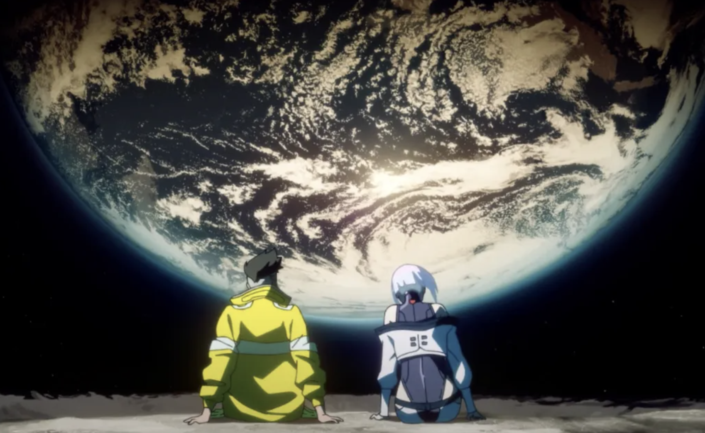

### Meet the one you want to go to the moon together

```{r echo=FALSE, fig.align='center', out.width='60%'}

```
Lucy & David in Night City

```{r}
ppl = 1
if (ppl == 0) {
  print("None")
} else {
  print("You found someone!")
}
```


---

# Add some fancy implants in you own body

How many implants you got?

```{r}
implants <- sample(1:10, 1)
print(paste0("You have ", implants, " implants!"))
```

---

### Fight and Get that people you want to the moon

But becarful! You have a chance to become a cyberpshcho and die!!!

```{r}
limitation = 5
if (implants < limitation) {
  print("You will stay sanity!")
} else {
  print("You will become a cyberpsycho and die!!!")
}
```

```{r echo=FALSE, fig.align='center', out.width='60%'}

```


